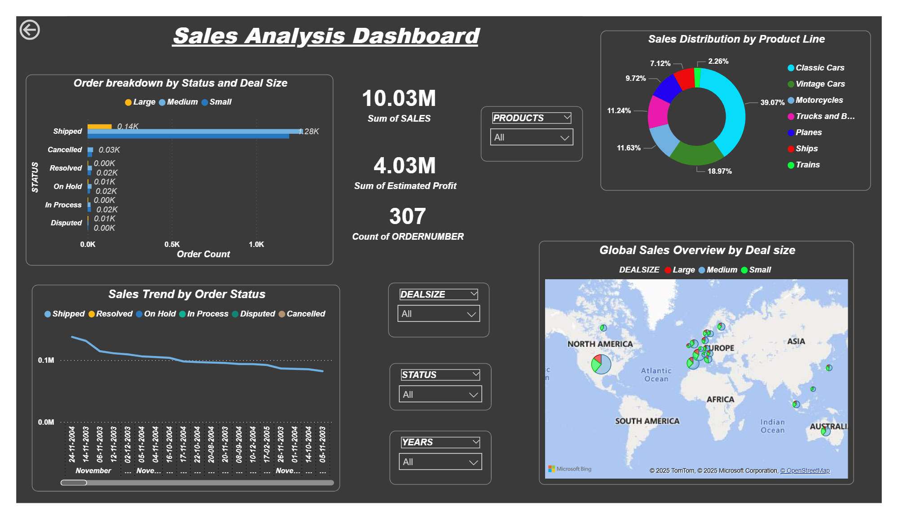

# Sales Analytics Dashboard with Python, PostgreSQL & Power BI

> One-line summary: Analyzed **[X]+ records** to uncover **[key insight]**, helping a business **[measurable outcome, e.g., identify the 3 regions driving 60% of revenue]**.



---

## 🎯 Problem Statement
A retail company has sales data spread across multiple files and no clear view of regional performance, product profitability, or demand trends. This project builds an end-to-end pipeline that cleans the data, stores it in PostgreSQL, analyzes it, and presents KPIs in an interactive dashboard.

## 🏆 Key Results
- Processed **[500K+]** records across **[N]** tables
- Identified **[insight 1, e.g., Top 10% of customers contribute 45% of revenue]**
- Built forecasting model with **[MAPE / R² / accuracy value]**
- Reduced manual reporting effort by **[X]%** through automated SQL views and refreshable dashboard

## 🛠️ Tech Stack
| Area | Tools |
|---|---|
| Programming | Python (pandas, NumPy, scikit-learn, matplotlib), SQL |
| Database | PostgreSQL |
| BI / Visualization | Power BI (DAX, data modeling) |
| Statistical Analysis | Hypothesis testing, regression, EDA |
| Version Control | Git, GitHub |

## 🗂️ Architecture
```
Raw CSV/Excel → Python (cleaning, EDA) → PostgreSQL (star schema) → Power BI Dashboard
                                      ↘ ML model (forecast / prediction) → Flask app
```

## 📁 Project Structure
```
├── Data/               # Raw and cleaned datasets (or download link)
├── SQL Queries/        # Schema, views, and analysis queries
├── dashboard/          # .pbix file and PDF export
└── README.md
```

## 🔍 Methodology
1. **Data Cleaning:** handled missing values, duplicates, and outliers in Python (pandas)
2. **Database Design:** created a star schema in PostgreSQL with fact and dimension tables
3. **SQL Analysis:** joins, CTEs, window functions, and aggregations to answer [N] business questions
4. **Statistical Analysis:** [e.g., correlation, t-test, regression] to validate findings
5. **Modeling:** [e.g., Random Forest / ARIMA / Prophet] to predict [target]
6. **Visualization:** Power BI dashboard with [N] KPIs, filters, and drill-downs


## 🚀 How to Run
```bash
git clone https://github.com/<username>/<repo>.git
cd <repo>
pip install -r requirements.txt
# 1. Create the database and load data
psql -U postgres -f sql/schema.sql
python load_data.py
# 2. Run notebooks or the app
jupyter notebook notebooks/
python app/app.py
```
Open `dashboard/<file>.pbix` in Power BI Desktop to explore the dashboard.

